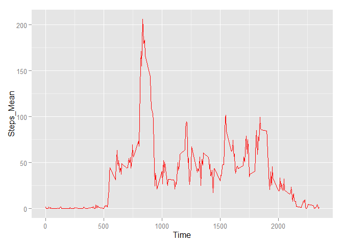

# Reproducible Research: Peer Assessment 1


## Loading and preprocessing the data

```r
setwd("C:/Users/tverbove/gitwork/RepData_PeerAssessment1")
unzip("activity.zip")
data_ACT <- read.csv("activity.csv", colClasses = c("integer", "Date", "factor"))
```


## What is mean total number of steps taken per day?

```r
data_ACT_NONA <- na.omit (data_ACT)
```


```r
library(ggplot2)
ggplot(data_ACT_NONA , aes(date, steps)) + geom_bar(stat = "identity", colour = "red", fill =  "orange") 
```

 


```r
  Steps_total <- aggregate(data_ACT_NONA$steps, list( data_ACT_NONA$date), FUN = "sum")
  mean(Steps_total$x)
```

```
## [1] 10766.19
```


```r
  median(Steps_total$x)
```

```
## [1] 10765
```


## What is the average daily activity pattern?


```r
Steps_means <- aggregate(data_ACT_NONA$steps, list(data_ACT_NONA$interval), FUN = "mean")
Steps_means$Time <- as.numeric(as.character (Steps_means$Group.1))
names(Steps_means)[2] <- "Steps_Mean"
Steps_means$Group.1 <- NULL

data_ACT_IMP <- data_ACT
ggplot(Steps_means, aes(Time, Steps_Mean)) + geom_line(color = "red")
```

 


```r
Steps_means[Steps_means$Steps_Mean == max(Steps_means$Steps_Mean), ]
```

```
##     Steps_Mean Time
## 272   206.1698  835
```


## Imputing missing values


```r
  sum(is.na(data_ACT))
```

```
## [1] 2304
```
 
#### The median for each 5-minute interval will be filled in for each NA value.


```r
data_ACT_IMP <- data_ACT

for (i in 1:nrow(data_ACT_IMP)) {
  if (is.na(data_ACT_IMP$steps[i])) {
    data_ACT_IMP$steps[i] <- Steps_means[which(data_ACT_IMP$interval[i] 
                                       == Steps_means$Time), ]$Steps_Mean
  }
}
```


```r
ggplot(data_ACT_IMP, aes(date, steps)) + geom_bar (stat = "identity",  colour = "red",    fill = "orange") 
```

 


```r
  Steps_total_nw <- aggregate(data_ACT_IMP$steps, list(data_ACT_IMP$date),  FUN = "sum")
      Mean_nw <- mean(Steps_total_nw$x)
      Mean_nw
```

```
## [1] 10766.19
```


```r
      Median_nw <- median(Steps_total_nw$x)
      Median_nw
```

```
## [1] 10766.19
```


```r
      Mean_org <- mean(Steps_total$x)
      Median_org <- median(Steps_total$x)
      
      Mean_nw - Mean_org
```

```
## [1] 0
```

```r
      Median_nw - Median_org
```

```
## [1] 1.188679
```

#### After the median was imputed for the NA's, the new mean of total steps is equal to the old mean, however, we do see a small difference in the total steps taken per day, which is greater for the new than for the old median.


## Are there differences in activity patterns between weekdays and weekends?


```r
data_ACT_IMP$weekdays <- factor(format(data_ACT_IMP$date, "%A"))
levels(data_ACT_IMP$weekdays) <- list(weekday = c("maandag", "dinsdag","woensdag", "donderdag","vrijdag") ,   
                                  weekend = c("zaterdag", "zondag"))
```


```r
Steps_means_nw <- aggregate(data_ACT_IMP$steps, 
                      list(interval = as.numeric(as.character(data_ACT_IMP$interval)), 
                       weekdays = data_ACT_IMP$weekdays), 
                       FUN = "mean")

names(Steps_means_nw)[3] <- "StepsMean_nw"

library(lattice)

xyplot(Steps_means_nw$StepsMean_nw ~ Steps_means_nw$interval | Steps_means_nw$weekdays, 
       layout = c(1, 2), type = "l", 
       xlab = "Time", ylab = "Steps")
```

 
